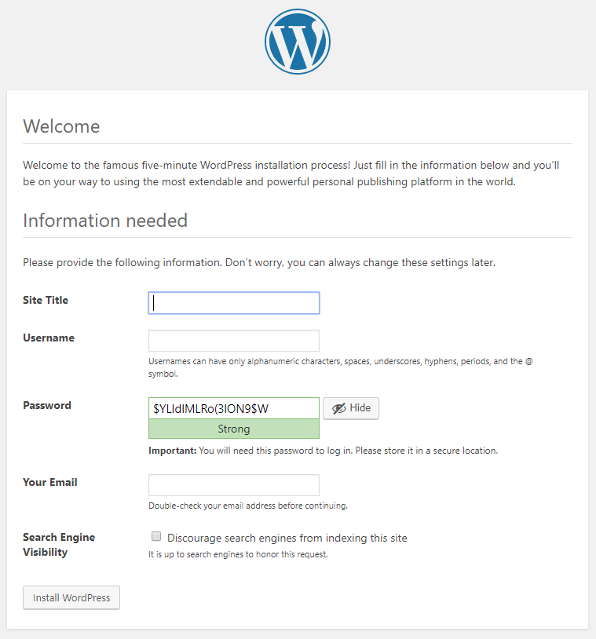

# WordPress on Lambda

Use at your own caution!!!

[Read the original article](https://keita.blog/?p=1796)

## Quick Start

This creates a cloudfront domain, api gateway, lambda function, aurora (MySQL) serverless cluster and security groups in a previously provisioned VPC.

### 0. Prerequisites

1. AWS CLI ([download](https://aws.amazon.com/cli/))
2. A recent version (^0.33.1) of the AWS SAM CLI with guided deployments ([download](https://docs.aws.amazon.com/serverless-application-model/latest/developerguide/serverless-sam-cli-install.html))

### 1. Use the guided SAM template to deploy the template once.
Run the following the deploy using your default AWS profile in ~/.aws/credentials:
```bash
sam deploy -g
```
or use the following to deploy in a custom profile:
```bash
sam deploy -g --profile REPLACE_THIS_WITH_NAMED_PROFILE
```
| Parameter | Description |
| ------------- | ------------- |
| Stack Name | Anything you want. Must be unique from what you already have in the region unless you want to update the stack. |
| AWS Region | Region you are deploying to. |
| VpcId | The VPC in the region you are deploying to. You can obtain this by going to https://console.aws.amazon.com/vpc/home?region=`AWS_REGION_HERE`#vpcs:sort=VpcId |
| VpcSubnetIds | A comma-delimited string of subnet IDs belonging to the VPC you specified earlier. You must specify at least 1 subnet ID. |
| StageName | (optional) Stage name of API gateway. |
| CloudFrontPriceClass | (optional) See [here](https://docs.aws.amazon.com/AWSCloudFormation/latest/UserGuide/aws-properties-cloudfront-distribution-distributionconfig.html#cfn-cloudfront-distribution-distributionconfig-priceclass) for a list of valid values. |
| DBName | (optional) The name of the database in the cluster to connect to |
| DBUser | (optional) Default: `admin`. The username of the database cluster |
| DBPassword | The password corresponding to DBUser. |
| Confirm changes before deploy | Y if you want to check changes, N otherwise.  |
| Allow SAM CLI role creation | Y, to let SAM manage our deployment bucket. |
| Save arguments to samconfig.toml | Y, so you don't need to go through the steps here again later. |

This will deploy the stack and required resources. Visiting the cloudfront domain won't work just yet.

### 2. Set up `wp-config.php`

Copy the modified wp-config-sample.php and replace all `cloudfront_domain_name_here` with the value of the `CloudFrontDistributionDomainName` (e.g. abcd.cloudfront.net) stack output you obtained from the previous step.

Linux/Mac:
```bash
cp ./src/php/wp-config-sample.php ./src/php/wp-config.php
sed -i "s/cloudfront_domain_name_here/REPLACE_THIS_WITH_CLOUDFRONT_DOMAIN/g" ./src/php/wp-config.php
```

### 3. Redeploy

```bash
sam deploy
```

We need to redeploy the updated `wp-config.php` onto our lambda function as it contains our settings. There is a circular dependency between cloudfront and the autogenerated IAM permissions for the function so placing the cloudfront domain as an environment variable won't work.

### 4. Deploy static assets

Replace `REPLACE_THIS_WITH_ASSETS_BUCKET_NAME` with the value of `AssetsBucketName` from the stack outputs obtained from the previous step.

```bash
aws s3 sync ./src/php s3://REPLACE_THIS_WITH_ASSETS_BUCKET_NAME --exclude "*.php" --exclude "*.ini"
```

or the following if you used a named profile in step 1:

```bash
aws s3 sync ./src/php s3://REPLACE_THIS_WITH_ASSETS_BUCKET_NAME --exclude "*.php" --exclude "*.ini" --profile REPLACE_THIS_WITH_NAMED_PROFILE
```

### 5. Visit cloudfront domain

You should see the following Wordpress 5.2.1 installation (everything under `./src/php`):



## Using a different Wordpress version

Throw everything away under ./src/php *except* for:

- `wp-config.php` or `wp-config-sample.php`
- `php.ini`
- `src/php/wp-content/S3-Uploads-2.1.0/*`
